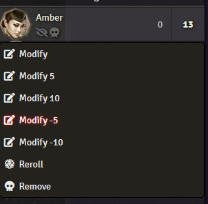

# FoundryVTT-Actor-Communicator
FoundryVTT Module giving players a way to organise and chat with contatcs and 'data' using a immersive communicator.

Module was made for Shadowrun 5 but can be configured to use other modify amounts using module settings.

## Installation

Paste the following link in the Install Module interface of your Foundry VTT instance:

https://raw.githubusercontent.com/taMiF/Combat-Modify-Initiative/master/module.json
